# PolyPaintPro
Collaborative drawing app and social media developed as a third-year project in Sofware engineering at Polytechnique Montreal.

## Team
- [Antoine Boisier-Michaud](https://github.com/Aboisier)
- Charlotte Sarrazin
- [Julien Dufresne](https://github.com/JulienDuf)
- [Laurent Caron](https://github.com/laurentcaron)
- [Rémi Pelletier](https://github.com/Remi05)
- [Simon Lacasse](https://github.com/LapinsMorts)

## Tech Stack
**Desktop app:** C#, WPF, XAML

**iOS app:** Swift

**Shared:** Firebase, Google Vision API, Google Drive API, Facebook API

## Captures

### Login
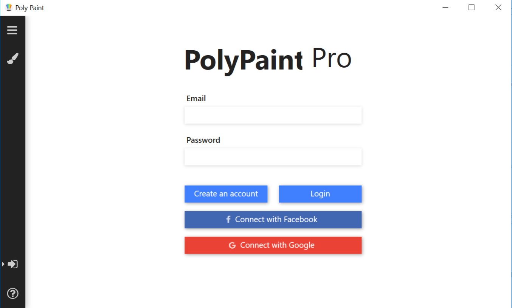

### Account Creation
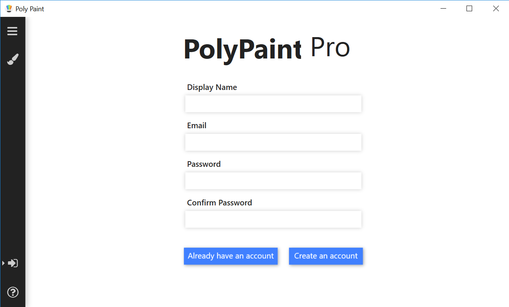

### Drawing
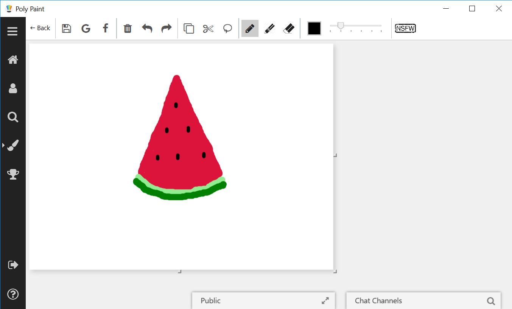

### Drawing Selection
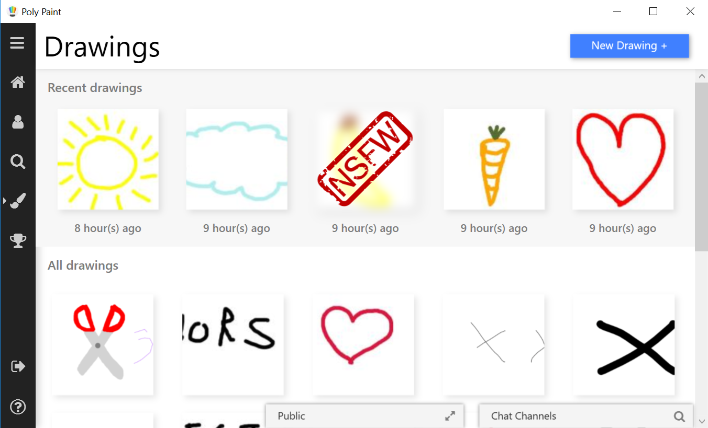

### Current User Profile
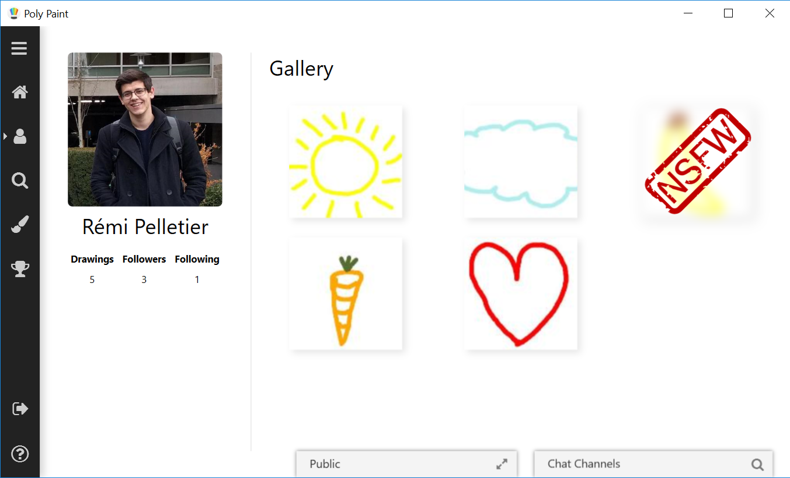

### Other User Profile
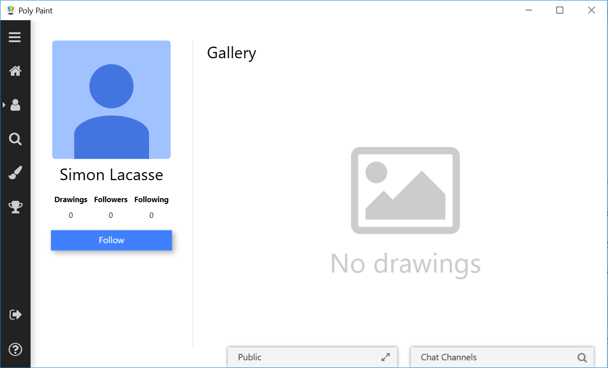

### Post
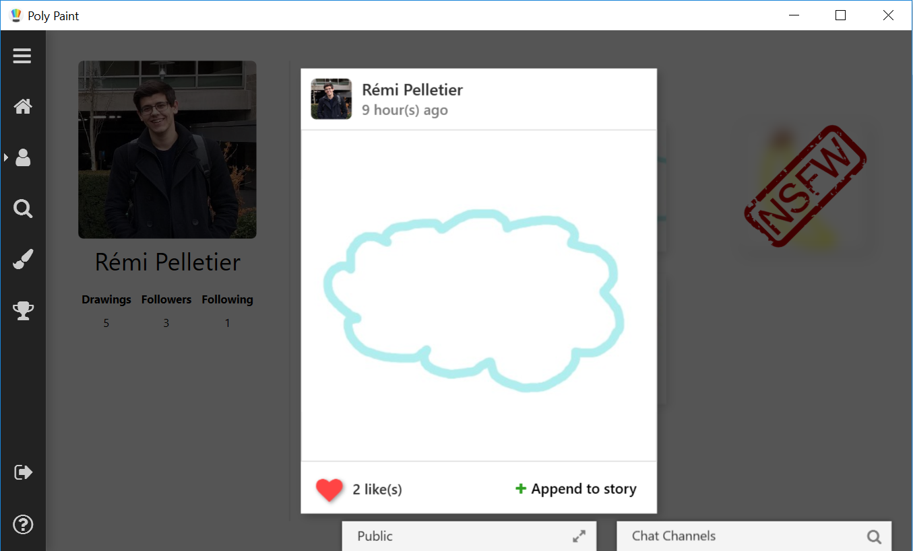

### Feed
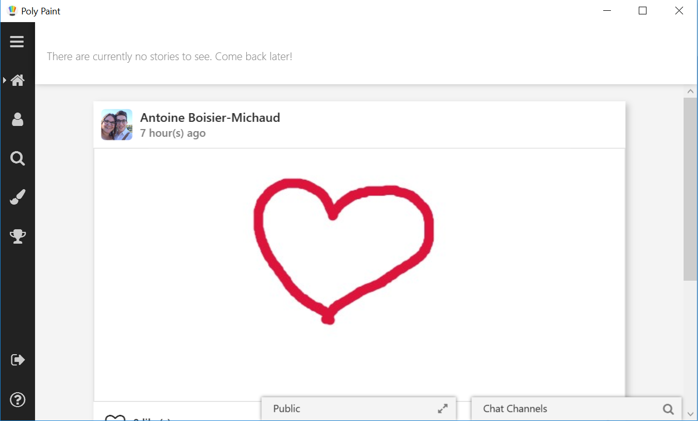

### Chat
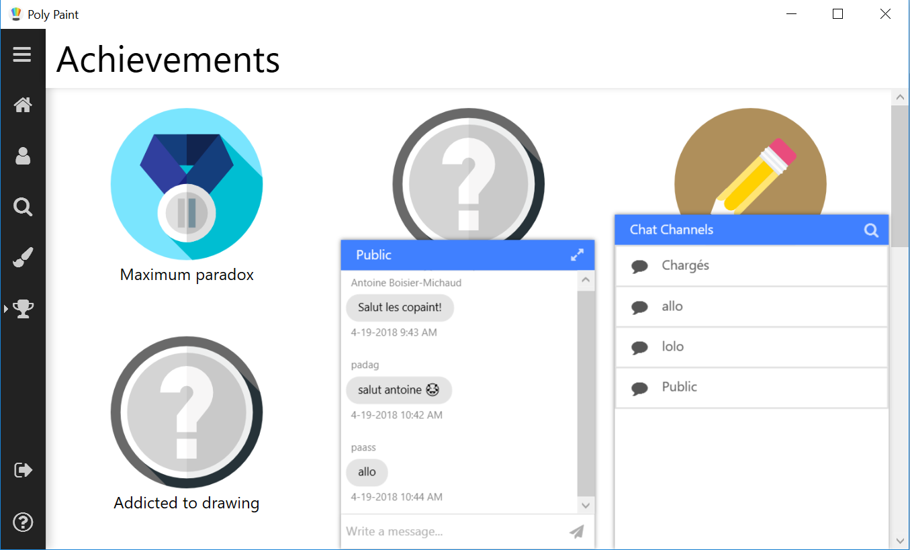

### Create Conversation
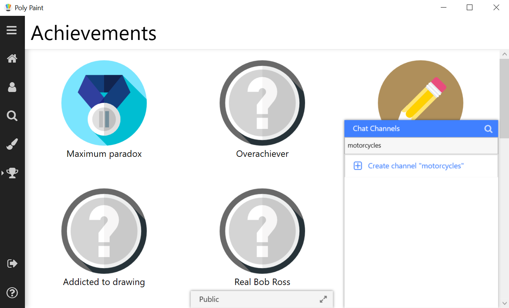

### Tutorial
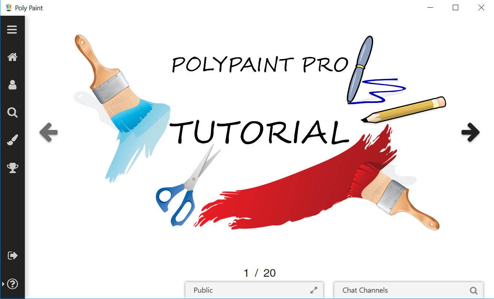

### User Search
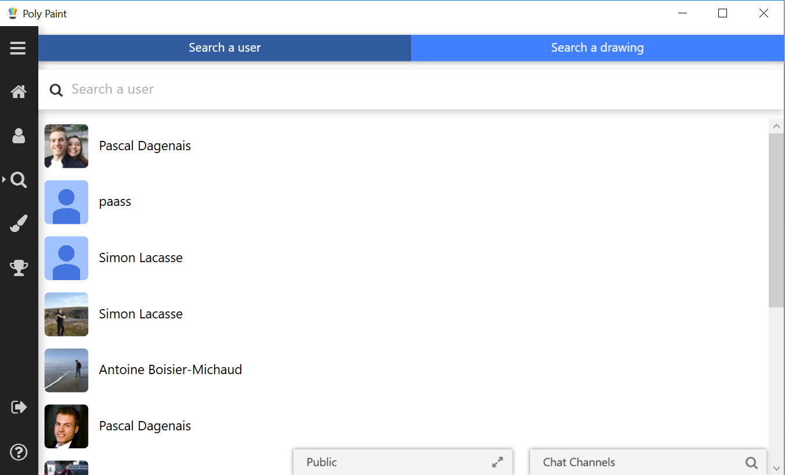

### Drawing Search

### Achievements
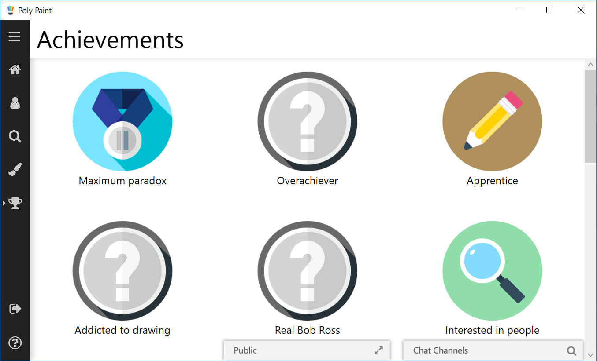

### Expanded Menu
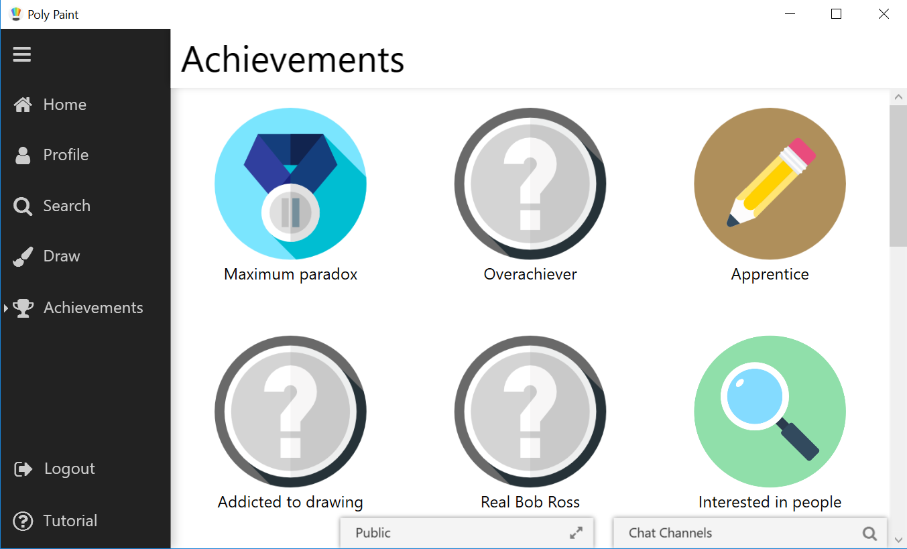
